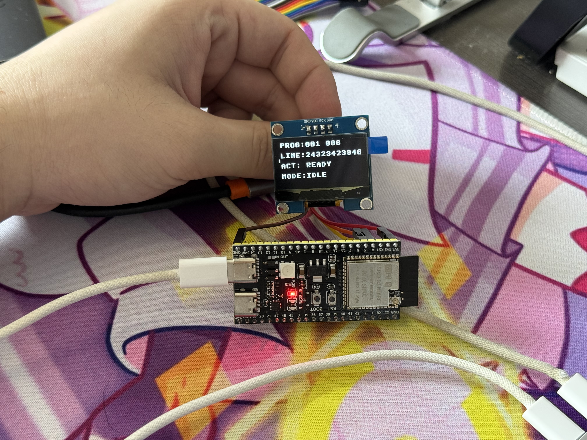
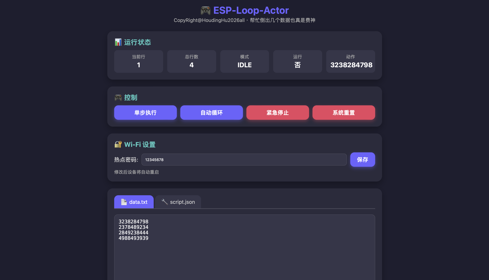
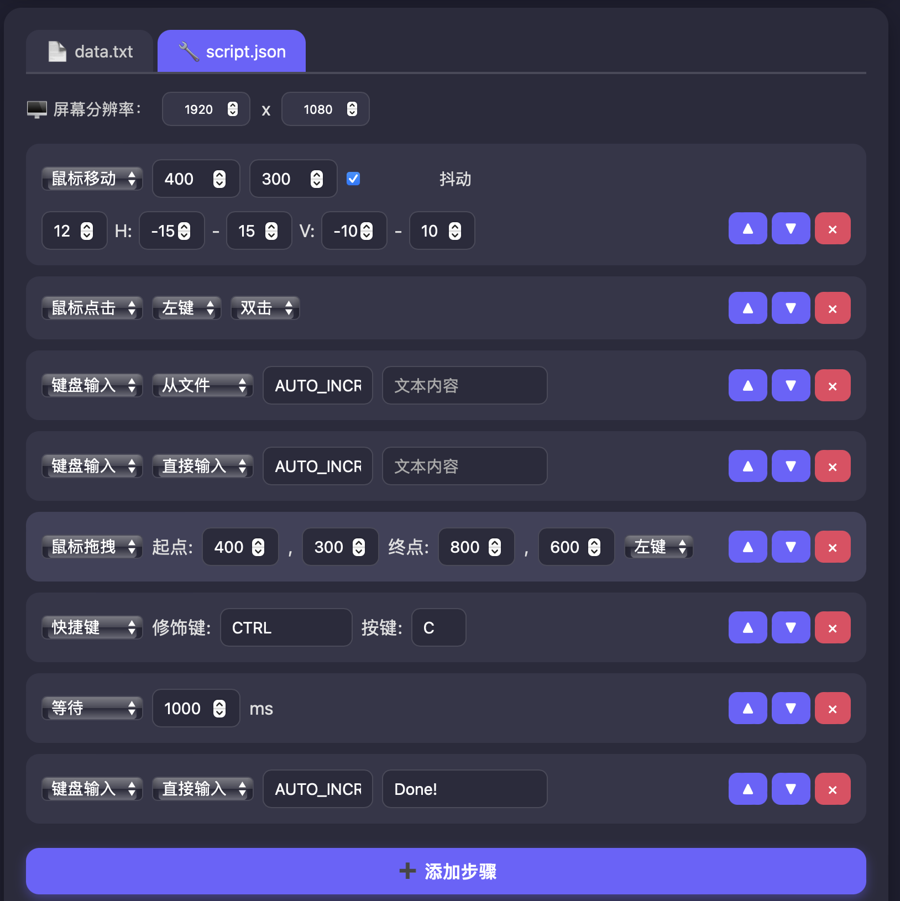

# ESP-Loop-Actor

> 基于 ESP32-S3 的免编程 USB HID 自动化设备  
> 复合鼠标键盘 · 配置文件驱动 · Web 无线管理 · 断电续传


---

## 📖 项目简介

**ESP-Loop-Actor** 将 ESP32-S3 变成一台自动模拟键鼠。插入电脑后，它会被识别为**绝对坐标鼠标 + 标准键盘**。你只需编辑两个简单的配置文件（`data.txt` 和 `script.json`），即可编排复杂的循环操作流程，全程无需编写任何代码。

设备自带 1.3 英寸 OLED 显示屏，实时显示进度和状态；同时创建 Wi‑Fi 热点，手机或电脑连接后可通过网页直接编辑配置、上传下载文件、控制设备运行，甚至修改 Wi‑Fi 密码。

---

## ✨ 功能特性

- **复合 HID 设备** – 绝对坐标鼠标（0–65535）+ 标准键盘（6 键无冲）
- **配置文件驱动** – `data.txt`（每行一条待输入文本） + `script.json`（动作脚本）
- **平滑移动与抖动** – 鼠标移动过程线性插值，可启用人性化轨迹抖动
- **多种动作类型** – 鼠标移动 / 点击 / 拖拽 / 键盘输入 / 快捷键 / 延时
- **三种工作模式** – 通过 BOOT 按键控制：单步执行、自动循环、一键复位
- **断电续传** – 当前行号保存在 NVS 中，掉电重启后可继续执行
- **OLED 屏幕显示** – 四行信息：进度、当前文本、动作提示、工作模式
- **Web 无线管理** – ESP32 自建热点（加密可选），浏览器直接编辑配置、控制设备
- **三击显示网络信息** – 快速三击 BOOT 键，屏幕显示 IP、SSID 和密码
- **手机/平板适配** – Web 界面响应式设计，移动端完美使用
- **易于扩展** – 模块化 C 代码，基于 ESP-IDF 原生组件，无第三方依赖

---

## 🔩 硬件要求

| 组件 | 说明 |
|------|------|
| **主控** | ESP32-S3（推荐 N16R8，16MB Flash + 8MB PSRAM） |
| **显示屏** | 1.3 寸 OLED，驱动 IC：CH1116（兼容 SSD1306），4 针 I2C，地址 0x3C |
| **按键** | 板载 BOOT 按键（GPIO0） |
| **LED** | 可选，一般板载 GPIO48 用于状态指示 |
| **接线** | 见下方表格 |

### 屏幕接线（I2C）

| 屏幕引脚 | ESP32-S3 引脚 |
|----------|----------------|
| VCC      | 3.3V          |
| GND      | GND           |
| SCL      | GPIO 4        |
| SDA      | GPIO 5        |



> ⚠️ **注意**：请使用 3.3V 供电，勿接 5V！连接前断开所有电源。

---

## 🚀 快速开始

### 1. 克隆仓库

```bash
git clone https://github.com/HuHanwenOfficail/esp-loop-actor.git
cd esp-loop-actor
```

### 2. 配置 ESP-IDF 环境

确保已安装 ESP-IDF v5.2 或更高版本，并激活环境：

```bash
. ~/esp/esp-idf/export.sh
```

### 3. 准备配置文件（可选）

默认固件会自动创建 `data.txt` 和 `script.json`。你也可以自定义它们，放在 `spiffs/` 目录下。

### 4. 编译、烧录

```bash
idf.py build
idf.py -p /dev/cu.usbmodemXXXX flash
```
或使用编译完成的发行固件。

（Windows 用户使用 `COMx` 作为端口）

### 5. 开始使用

1. 同时连接 **COM 口**（烧录用）和 **USB 口**（HID 通信）到电脑。
2. 设备启动后，OLED 屏幕显示 `ESP-Loop-Actor` 并进入 IDLE 状态。
3. 手机或电脑搜索 Wi‑Fi `ESP-Loop-Actor`（默认无密码），连接后浏览器访问 `http://192.168.4.1`。
4. 通过网页上传你的 `data.txt` 和 `script.json`，或直接在线编辑。
5. 使用 BOOT 按键或网页按钮控制设备运行。

---

## 🕹️ 按钮操作规则

设备上的 **BOOT** 按键（GPIO0）支持多种操作：

| 操作 | 动作 | 说明 |
|------|------|------|
| **单击** | 单步执行 (STEP) | 执行一次完整的脚本循环，完成后停止，行号 +1 |
| **双击**（500ms 内） | 自动循环 (AUTO) | 从当前行开始连续循环执行，每轮行号 +1，直至行号超出总行数或手动停止 |
| **长按**（>2 秒） | 系统复位 (RESET) | 立即停止所有动作，行号重置为 1，清除 NVS，鼠标回原点 (0,0)，设备重启 |
| **三击**（300ms 内） | 显示网络信息 | 屏幕临时显示 Wi‑Fi SSID、密码和 IP 地址，持续 4 秒后恢复 |

---

## 📝 JSON 配置文件格式

完整的 JSON 规范请参阅 [spiffs/rule.md](spiffs/rule.md)。下面是一个简单的示例：

```json
{
  "meta": {
    "name": "简单演示",
    "base_resolution": { "width": 1920, "height": 1080 },
    "default_pre_delay_ms": 20,
    "default_post_delay_ms": 80,
    "loop": {
      "enabled": true,
      "reset_position": { "x": -10, "y": -10 },
      "reset_position_after_each_loop": true
    }
  },
  "steps": [
    {
      "id": 1,
      "ui_hint": "移动到 (200,400)",
      "action": { "type": "mouse_move", "x": 200, "y": 400 }
    },
    {
      "id": 2,
      "ui_hint": "左键单击",
      "action": { "type": "mouse_click", "button": "LEFT", "click_type": "CLICK" }
    },
    {
      "id": 3,
      "ui_hint": "输入当前行",
      "action": { "type": "keyboard_input", "input_mode": "file", "line_index": "AUTO_INCREMENT" }
    }
  ]
}
```

### 支持的动作类型

| 类型 | 关键参数 |
|------|----------|
| `mouse_move` | `x`, `y`, 可选抖动参数 `jitter_enabled`, `jitter_strength`, `h_min/h_max`, `v_min/v_max` |
| `mouse_click` | `button` (`LEFT`/`RIGHT`/`MIDDLE`), `click_type` (`CLICK`/`DOUBLE_CLICK`/`PRESS`/`RELEASE`) |
| `mouse_drag` | `start` 坐标, `end` 坐标, `button` |
| `keyboard_input` | `input_mode` (`file` 或 `literal`), `line_index` 或 `literal_text`, 可选随机延迟 |
| `keyboard_hotkey` | `modifiers` 数组 (`CTRL`,`SHIFT`,`ALT`,`GUI`), `key` 字符 |
| `wait` | `duration_ms` 毫秒 |

---

## 🌐 Web 管理界面

连接 Wi‑Fi 热点后，浏览器访问 `http://192.168.4.1`，你可以：

- 实时查看设备运行状态（当前行、模式、动作）
- 远程控制设备（单步、自动、停止、复位）
- 编辑并保存 `data.txt`（纯文本编辑器）
- 可视化编辑 `script.json`（图形化步骤编辑器，支持分辨率设置、抖动参数、拖拽排序）
- 上传/下载配置文件
- 修改 Wi‑Fi 密码（保存后设备自动重启）




---

## 🧱 项目结构

```
esp-loop-actor/
├── main/
│   ├── esp-loop-actor.c   # 主程序（HID、屏幕、按键、JSON 解析）
│   ├── web_server.c       # Web 服务器（Wi‑Fi 热点、HTTP API、网页嵌入）
│   └── CMakeLists.txt
├── spiffs/                # SPIFFS 数据（data.txt, script.json, rule.md 等）
├── partitions.csv         # 分区表
├── CMakeLists.txt         # 顶层 CMake
├── sdkconfig              # SDK 配置（已包含所需选项）
└── README.md
```

---

## 📄 许可证

本项目使用 [MIT License](LICENSE)。  
版权所有 © 2026 Houding Hu

---

## 🤝 贡献

欢迎提交 Issue 或 Pull Request，共同完善这个项目！

---

**Enjoy your automated workflow!** 🚀
```
